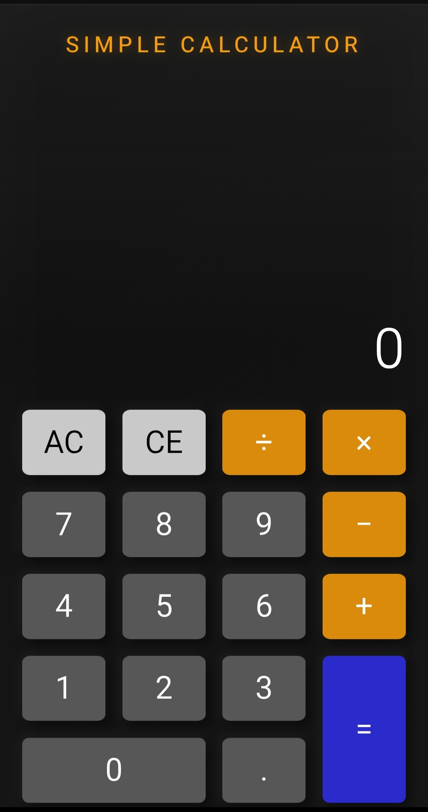

# Calculator PWA

Simple calculator berbasis HTML, CSS, dan JavaScript.
Dioptimalkan untuk smartphone dan dapat diinstall sebagai aplikasi Android (PWA).
catatan: Kurang bagus di tampilan PC

## Fitur
- Mobile-first layout
- Fullscreen PWA
- Offline support
- Touch friendly UI

## Cara Install
1. Buka aplikasi di Chrome Android
2. Menu (⋮) → Add to Home Screen
3. Jalankan seperti aplikasi native

## Screenshot

